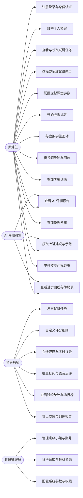
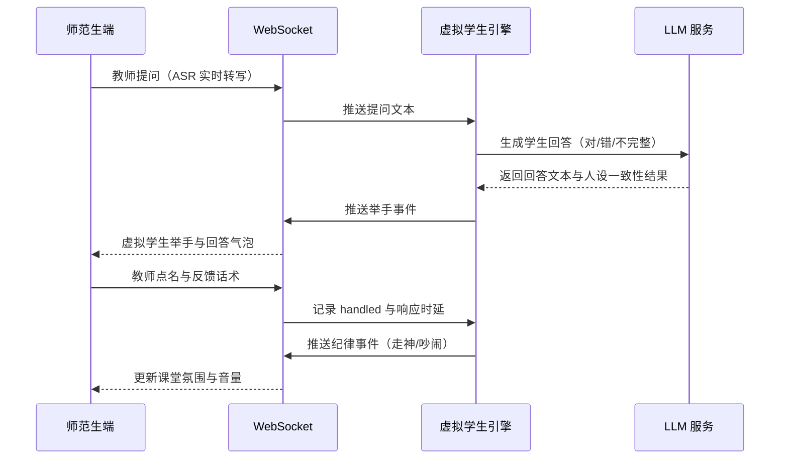
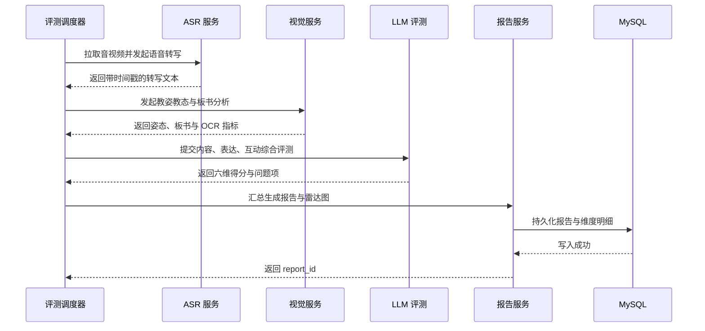
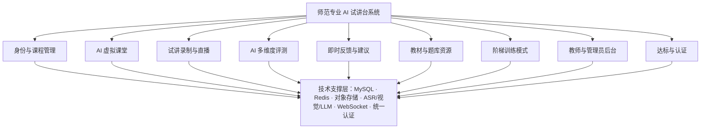

# 第 05 组　师范专业 AI 试讲台系统　需求分析说明书

| 项目 | 内容 |
|---|---|
| 系统名称 | 师范专业 AI 试讲台系统（AI Virtual Micro-teaching Platform） |
| 文档类型 | 需求分析说明书（SRS） |
| 文档版本 | V1.0 |
| 编写小组 | 第 05 组 |
| 编写日期 | 2026-09-18 |
| 适用范围 | 师范类专业微格教学、教师资格证面试训练、教学技能大赛备赛、课堂实训 |
| 关联文档 | 《师范 AI 试讲台\_数据项清单与实体边界.md》（数据字典，43 实体 / 382 数据项） |

**修订记录**

| 版本 | 日期 | 修订内容 | 修订人 |
|---|---|---|---|
| V0.1 | 2026-09-15 | 完成数据项提取与实体边界划分 | 第 05 组 |
| V1.0 | 2026-09-18 | 完成用例建模、动态建模、功能架构与需求详述 | 第 05 组 |

---

## 目录

1. [引言](#1-引言)
2. [系统概述](#2-系统概述)
3. [需求建模](#3-需求建模)
4. [功能架构](#4-功能架构)
5. [功能需求详述](#5-功能需求详述)
6. [非功能需求](#6-非功能需求)
7. [数据需求说明](#7-数据需求说明)
8. [接口需求](#8-接口需求)
9. [附录 A：假设与待确认事项](#9-附录-a假设与待确认事项)
10. [附录 B：模型源码（Mermaid）](#10-附录-b模型源码mermaid)

---

## 1 引言

### 1.1 编写目的

本文档面向师范专业 AI 试讲台系统的开发团队、指导教师与教研管理人员，完整描述系统的业务目标、用户角色、功能需求、非功能需求与数据需求，并给出用例模型、动态模型与功能架构模型。本文档是后续概要设计、详细设计、编码实现与系统测试的唯一需求基线，也是项目验收的依据。

### 1.2 项目背景与意义

师范生的教学能力培养长期依赖微格教学与真实课堂试讲，但在实际教学中存在四类突出矛盾：

1. **实训机会稀缺**：真实课堂资源有限，一名师范生在四年培养周期内完整试讲次数普遍不足 10 次，难以形成稳定的教学技能。
2. **评价主观且滞后**：传统试讲评价依赖指导教师现场打分，评分口径因人而异，反馈往往滞后数天，学生已遗忘当时的课堂状态。
3. **缺乏可控的复杂情境**：真实课堂中的学生质疑、课堂混乱、设备故障等突发情况不可预设、不可复现，师范生的应变与控场能力难以专项训练。
4. **过程数据无法沉淀**：试讲过程缺少结构化记录，学生的进步轨迹、薄弱项分布无法量化，教师难以开展针对性指导。

本系统以"虚拟学生 + AI 多维度评测"为核心，构建可复现、可量化、可反复训练的虚拟试讲环境，实现**课前磨课、技能训练、教学评价、达标认证**的一体化闭环，替代并辅助真实课堂试讲。

### 1.3 适用范围与系统边界

**系统包含的能力**：身份与课程管理、AI 虚拟课堂、试讲录制与直播、AI 多维度评测、即时反馈与改进建议、教材与题库资源、阶梯训练模式、教师与管理员后台、达标与认证，共九大功能模块。

**系统不包含的能力**（明确边界，避免范围蔓延）：

| 不含内容 | 说明 |
|---|---|
| 真实学生参与的在线直播教学 | 本系统的"课堂"完全由虚拟学生构成，不承担真实教学任务 |
| 正式教师资格证考试报名与官方成绩认定 | 仅提供训练与模拟考核，不具备官方认证效力 |
| 教务系统学籍与成绩总库 | 仅通过导入方式同步班级/学生基础数据，不接管教务业务 |
| 通用办公协同（IM、日程、网盘） | 复用学校既有平台，不重复建设 |
| 教材正文全文检索与数字教材出版 | 仅提供题目、章节定位与模板资源 |

### 1.4 术语与缩略语

| 术语 | 说明 |
|---|---|
| 微格教学 | 借助音视频手段，对师范生某项教学技能进行小规模、短时长、可回放的专项训练方式 |
| 虚拟学生 | 由系统按人设模型生成的模拟学习者，可产生举手、提问、作答、走神、吵闹等行为 |
| 情景模拟 | 按预设脚本在试讲过程中注入突发事件的训练模式，如学生质疑、课堂混乱、设备故障 |
| 结构化面试 | 教师资格证面试中的非试讲环节，按职业认知、心理素质、应急应变等类别抽题作答 |
| 六维评测 | 教学内容、教学表达、教姿教态、互动控场、板书与 PPT 呈现、时间管理六个评分维度 |
| ASR | 自动语音识别，将试讲音频转写为带时间戳的文本 |
| TTS | 文本转语音，用于生成优化话术的示范音频 |
| OCR | 光学字符识别，用于板书内容识别与字迹工整度分析 |
| 对象存储 | 用于存放音视频等非结构化文件的云端存储服务 |
| 口头禅 | 试讲过程中高频出现的无意义填充词，如"嗯""那个""就是" |

### 1.5 参考资料

1. 原始需求文档《师范专业 AI 试讲台系统功能需求说明》（9 大模块）
2. 《师范 AI 试讲台\_数据项清单与实体边界.md》（本组编制的数据字典）
3. GB/T 8567-2006《计算机软件文档编制规范》
4. 教育部《教师教育课程标准（试行）》
5. 全国中小学教师资格考试面试大纲

---

## 2 系统概述

### 2.1 系统目标

| 编号 | 目标 | 衡量方式 |
|---|---|---|
| G1 | 提供可反复使用的虚拟试讲环境，摆脱真实课堂资源约束 | 学生人均每学期完整试讲 ≥ 12 次 |
| G2 | 对试讲过程进行客观、可解释的多维度自动评分 | 六维自动评分与教师评分的平均偏差 ≤ 8 分 |
| G3 | 将反馈周期从"天"缩短到"分钟"，并定位到具体时间段 | 试讲结束后 5 分钟内出具评测报告 |
| G4 | 提供可复现的突发情境训练，专项提升控场与应变能力 | 覆盖 ≥ 20 类典型突发情景 |
| G5 | 沉淀训练过程数据，形成能力画像与进步曲线 | 提供六维进步曲线与班级薄弱项分布 |
| G6 | 建立可追溯的技能达标认证体系 | 证书支持编号验真与佐证报告回溯 |

### 2.2 用户角色与特征

| 角色 | 人群特征 | 核心诉求 | 关键权限 |
|---|---|---|---|
| 师范生 | 师范类专业在读学生，教学经验不足，需要高频练习与明确改进指引 | 随时练习、即时知道哪里不好、知道怎么改 | 发起试讲、查看本人报告与证书、参加训练与考核 |
| 指导教师 | 微格教学任课教师、教法课教师、校外导师 | 减轻批阅负担、掌握全班薄弱项、给出针对性指导 | 发布任务、在线观摩、批阅点评、查看班级数据、配置评分细则 |
| 教研管理员 | 院系教务与教研管理人员 | 统一题库与评分口径、掌握整体训练态势 | 班级与账号管理、题库维护、系统参数与权限配置 |
| AI 评测引擎 | 系统内部角色，非自然人 | 稳定输出可解释的评分与建议 | 消费音视频与行为事件，输出评测报告与改进建议 |

### 2.3 业务总流程

系统的核心业务闭环为：**任务发布 → 备课抽题 → 配置虚拟课堂 → 试讲互动 → 录制上传 → AI 评测 → 报告与建议 → 教师批阅 → 薄弱项识别 → 专项训练推送 → 达标认证**。

一次完整试讲的典型过程如下：师范生领取教师发布的试讲任务（或自主发起自由练习），按学段、学科、教材版本抽取或指定试讲题目；进入虚拟课堂后设定虚拟学生人数、行为强度与课堂环境；试讲过程中系统按人设模型与情景脚本驱动虚拟学生产生举手、提问、作答、走神、吵闹等行为，师范生需完成提问引导、应答反馈与纪律处理；全过程进行人像、屏幕、板书、音频多轨录制；试讲结束后音视频进入 AI 评测流水线，由 ASR、视觉分析与大模型分别完成表达、教态、板书与内容评测，汇总生成六维得分、问题定位与改进建议；教师可在线批阅并给出文字或语音点评；系统聚合历史数据形成进步曲线与薄弱项，推送专项训练；达到分数线后生成技能达标证书。

### 2.4 技术架构概述

系统采用前后端分离的微服务架构，PC Web 端优先并兼容 H5。

| 层次 | 技术选型与职责 |
|---|---|
| 前端 | PC Web 为主、H5 为辅；WebRTC 完成人像与音频采集，Canvas/WebGL 渲染虚拟课堂，WebSocket 完成实时互动与直播观摩，录播控件负责多轨同步录制 |
| 接入层 | API 网关负责路由、鉴权、限流与日志 |
| 业务服务 | 认证服务、用户与组织服务、任务服务、课堂服务、媒体服务、评测调度服务、报告服务、统计服务、认证服务；服务间通过 REST 与消息队列协作 |
| AI 能力 | ASR 语音转写、视觉教姿与板书分析、OCR 板书识别、大模型内容评测与建议生成，均以异步任务方式接入 |
| 数据存储 | MySQL 存储业务关系数据；Redis 存储会话、实时榜单、连接状态与任务队列；对象存储存放音视频与图片；题库检索可选 Elasticsearch |
| 实时通道 | WebSocket 承载虚拟学生行为推送、教师在线指导、直播观摩与计时同步 |
| 接口形式 | 对外 RESTful API；实时类交互采用 WebSocket |

---

## 3 需求建模

### 3.1 用例建模

#### 3.1.1 参与者定义

| 参与者 | 类型 | 职责描述 |
|---|---|---|
| 师范生 | 主要参与者 | 系统的主要使用者，完成试讲训练、查看评测结果、参加训练与考核、申领证书 |
| 指导教师 | 主要参与者 | 发布任务、观摩指导、批阅点评、掌握班级训练态势 |
| 教研管理员 | 主要参与者 | 维护组织、账号、题库与系统参数 |
| AI 评测引擎 | 次要参与者（系统） | 自动完成多维度评测、生成报告与改进建议、识别薄弱项 |
| 虚拟学生引擎 | 次要参与者（系统） | 按人设模型与情景脚本生成学生行为事件 |
| 对象存储 | 次要参与者（系统） | 接收并保存录制的音视频文件 |

#### 3.1.2 总体用例图


总体用例图刻画了四类参与者与 23 个用例之间的关系。师范生侧围绕"练习—评测—改进—认证"主线展开；指导教师侧围绕"布置—观摩—批阅—统计"主线展开；教研管理员负责组织、题库与系统配置；AI 评测引擎作为系统参与者，为评测报告、改进建议与薄弱项识别提供自动能力。

#### 3.1.3 子系统用例图

**模块一：身份与课程管理**


师范生完成注册登录与专业、年级、学科绑定并加入班级与小组；指导教师创建班级与小组、维护成员并发布试讲任务；教研管理员维护专业与学科字典、账号与权限。

**模块二：AI 虚拟课堂**


师范生配置虚拟学生人数与行为强度、选择课堂环境与氛围音，并按需开启自由试讲、情景模拟或结构化面试；试讲过程中需处理虚拟学生的提问作答与课堂纪律事件。虚拟学生引擎负责行为生成，AI 引擎负责情景脚本与学生回答内容生成。

**模块三：试讲录制与直播**


师范生侧支持多轨录制的开启、暂停恢复、结束上传、回看复盘与批注标记；教师侧支持在线观摩与实时文字指导；对象存储负责文件持久化。

**模块四：AI 多维度评测**


评测以异步任务方式执行：提交评测任务后依次完成语音转写与表达分析、视觉教姿教态分析、板书与 PPT 分析、互动与控场分析、教学环节时间切分，最终生成六维得分与评测报告。

**模块五：即时反馈与改进建议**


师范生查看评测报告与能力雷达图，定位到具体时间段的问题片段，获取优化话术、示范片段与逐句对照建议，并对建议是否有用进行反馈标记。

**模块六：教材与题库资源**


师范生按学段学科检索题目、查看教材章节、下载教案与板书模板、观看优秀范例；教师与管理员分别维护试讲题库与结构化面试题库。

**模块七：阶梯训练模式**


训练按入门、进阶、高阶、考核四级递进：跟读训练纠正语音语调，无提示完整试讲训练全流程把控，突发情景模拟训练应变控场，全真模拟考核按考官标准计时评分；系统根据训练记录推荐下一步内容。

**模块八：教师与管理员后台**


教师查看班级试讲数据与薄弱项分布，进行批量批阅打分与文字语音点评，导出成绩与训练报告，查看排行榜，并自定义评分细则、发布作业任务。

**模块九：达标与认证**


系统在达标判定后生成并颁发技能证书，师范生可查看下载证书、在线验真、查看进步曲线并接收专项训练推送；指导教师可参与达标复核。

#### 3.1.4 关键用例规约

**UC-01 配置并启动虚拟试讲**

| 项目 | 内容 |
|---|---|
| 用例编号 | UC-01 |
| 参与者 | 师范生、虚拟学生引擎 |
| 优先级 | 高（Must） |
| 前置条件 | 师范生已登录；已选定试讲题目或自主练习主题 |
| 后置条件 | 生成试讲场次 session，虚拟学生实例创建完成，计时开始 |
| 基本事件流 | 1. 学生选择试讲模式（自由试讲 / 情景模拟 / 结构化面试）<br>2. 设定虚拟学生人数（1–60）、行为强度（低/中/高）<br>3. 选择课堂环境（黑板 / PPT 投影 / 多媒体教室 / 幼儿园活动室）与氛围音<br>4. 系统创建场次并初始化虚拟学生人设与座位<br>5. 情景模拟模式下加载事件时间轴脚本<br>6. 系统渲染虚拟课堂并开始计时<br>7. 学生开始试讲 |
| 异常事件流 | 4a. 摄像头或麦克风未授权：提示授权要求并阻断启动<br>5a. 情景脚本加载失败：降级为自由试讲并提示<br>6a. 浏览器不支持采集：提示更换浏览器或安装插件 |
| 业务规则 | 人数上限 60；行为强度越高纪律事件频率越高；结构化面试模式不加载虚拟课堂环境 |

**UC-02 虚拟课堂实时互动**

| 项目 | 内容 |
|---|---|
| 用例编号 | UC-02 |
| 参与者 | 师范生、虚拟学生引擎、AI 引擎 |
| 优先级 | 高（Must） |
| 前置条件 | 试讲场次进行中 |
| 后置条件 | 行为事件与应对话术被完整记录，供互动控场维度评分 |
| 基本事件流 | 1. 虚拟学生按人设与强度产生举手、提问、作答、走神、小声说话、吵闹等行为<br>2. 系统通过 WebSocket 推送行为事件并渲染课堂画面<br>3. 学生进行提问、点名、反馈评价或纪律处理<br>4. 系统记录事件是否被处理与响应时延<br>5. 情景模拟模式下按脚本注入突发事件（学生质疑、课堂混乱、设备故障） |
| 异常事件流 | 1a. WebSocket 断连：自动重连并缓存未推送事件，恢复后补发<br>3a. 音频中断：记录中断时间段并在报告中标注 |
| 业务规则 | 学生回答分为正确 / 错误 / 不完整三类；纪律事件 30 秒内未处理记为未处理；所有事件以相对场次的 offset_ms 记录 |

**UC-03 试讲录制与上传**

| 项目 | 内容 |
|---|---|
| 用例编号 | UC-03 |
| 参与者 | 师范生、对象存储 |
| 优先级 | 高（Must） |
| 前置条件 | 试讲进行中或已开始 |
| 后置条件 | 录制记录与文件地址写入成功，评测任务入队 |
| 基本事件流 | 1. 开启人像、屏幕、板书、音频多轨录制<br>2. 支持暂停与恢复<br>3. 试讲结束后停止录制并分片上传<br>4. 服务端校验完整性并写入录制记录<br>5. 可选触发多轨合成<br>6. 发布 AI 评测任务消息 |
| 异常事件流 | 3a. 网络中断：本地缓存并恢复后续传<br>4a. 校验失败：提示重新上传，保留本地文件 |
| 业务规则 | 单轨文件 ≤ 2GB；默认云端存储；录制默认保留 180 天 |

**UC-04 AI 多维度评测**

| 项目 | 内容 |
|---|---|
| 用例编号 | UC-04 |
| 参与者 | AI 评测引擎 |
| 优先级 | 高（Must） |
| 前置条件 | 录制文件上传完成，评测任务已入队 |
| 后置条件 | 生成评测报告与六维得分、问题项与改进建议 |
| 基本事件流 | 1. 调度器拉取音视频并发起 ASR 转写<br>2. 视觉服务完成教姿教态与板书分析（可选 OCR）<br>3. 大模型完成内容准确性、逻辑、互动与控场评测<br>4. 完成教学环节时间切分与占比计算<br>5. 按评分标准汇总六维得分与总分<br>6. 生成问题项与改进建议<br>7. 持久化报告并通知学生 |
| 异常事件流 | 1a. ASR 失败：重试 2 次，仍失败则标记报告中"表达维度不可用"<br>2a. 人像遮挡严重：降低教态维度置信度并提示人工复核<br>7a. 评测超时（>10 分钟）：标记失败并支持手动重算 |
| 业务规则 | 六维权重取自任务绑定的评分标准；报告一经生成不可变更，教师复核以追加字段方式记录；模型版本号须写入报告 |

**UC-05 查看评测报告与改进建议**

| 项目 | 内容 |
|---|---|
| 用例编号 | UC-05 |
| 参与者 | 师范生、AI 引擎 |
| 优先级 | 高（Must） |
| 前置条件 | 评测报告已生成 |
| 后置条件 | 记录建议采纳情况，用于改进推荐效果 |
| 基本事件流 | 1. 学生打开评测报告<br>2. 查看总分、等级与六维雷达图<br>3. 查看问题项列表及严重程度<br>4. 点击问题项跳转到对应视频时间段<br>5. 查看优化话术、示范片段与逐句对照建议<br>6. 对建议标记是否有用 |
| 异常事件流 | 4a. 对应视频已过期删除：仅展示文本证据 |
| 业务规则 | 问题项按时长与严重程度排序；逐句建议须给出原始表述与优化表述对照 |

**UC-06 教师在线观摩与批阅**

| 项目 | 内容 |
|---|---|
| 用例编号 | UC-06 |
| 参与者 | 指导教师 |
| 优先级 | 高（Must） |
| 前置条件 | 教师具备该班级管理权限；场次存在且已产生报告 |
| 后置条件 | 批阅记录写入，最终得分回算，学生收到通知 |
| 基本事件流 | 1. 教师进入观摩房间观看直播或回看<br>2. 可发送实时文字指导<br>3. 打开批阅界面查看 AI 评分明细<br>4. 按评分细则打分并填写文字或语音点评<br>5. 提交批阅，系统回算最终得分<br>6. 支持批量批阅同任务下的多份试讲<br>7. 学生收到批阅完成通知 |
| 异常事件流 | 5a. 教师未评完所有细则项：禁止提交并提示缺失项 |
| 业务规则 | 最终得分优先取教师评分，未批阅时取 AI 分；语音点评 ≤ 5 分钟 |

**UC-07 发布试讲任务**

| 项目 | 内容 |
|---|---|
| 用例编号 | UC-07 |
| 参与者 | 指导教师 |
| 优先级 | 高（Must） |
| 前置条件 | 教师已登录且管理至少一个班级 |
| 后置条件 | 任务进入"已发布"状态，学生可见 |
| 基本事件流 | 1. 填写任务名称、面向班级、学科、学段、教材版本<br>2. 指定或允许学生抽取试讲题目<br>3. 选择试讲模式与时长上限<br>4. 选择评分标准（系统预置或自定义）<br>5. 设置允许重做次数、是否必须录像、截止时间<br>6. 发布任务并通知学生 |
| 异常事件流 | 4a. 未绑定评分标准：默认使用系统预置通用标准<br>6a. 截止时间早于当前时间：阻止发布 |
| 业务规则 | 时长上限 5–45 分钟；任务发布后评分标准版本被固化引用 |

**UC-08 参加阶梯训练**

| 项目 | 内容 |
|---|---|
| 用例编号 | UC-08 |
| 参与者 | 师范生、AI 引擎 |
| 优先级 | 中（Should） |
| 前置条件 | 学生已登录 |
| 后置条件 | 生成训练记录，并给出下一步推荐 |
| 基本事件流 | 1. 学生选择训练层级（入门 / 进阶 / 高阶 / 考核）<br>2. 系统匹配训练素材或情景脚本<br>3. 学生完成训练（跟读朗读 / 完整试讲 / 情景应对）<br>4. 系统给出训练得分与纠正提示<br>5. 系统根据本次表现推荐下一步训练内容 |
| 异常事件流 | 3a. 中途退出：记录部分时长并标记为未完成 |
| 业务规则 | 跟读训练按语音、语调、语速、停顿、重音分类；推荐结果须说明推荐理由 |

**UC-09 参加全真模拟考核**

| 项目 | 内容 |
|---|---|
| 用例编号 | UC-09 |
| 参与者 | 师范生、AI 评测引擎 |
| 优先级 | 中（Should） |
| 前置条件 | 学生已登录；存在可用考核任务 |
| 后置条件 | 生成考核成绩、通过结论，达标者具备证书申领资格 |
| 基本事件流 | 1. 学生进入模拟考核<br>2. 系统按学段学科随机抽取结构化题与试讲题<br>3. 启动备课与试讲倒计时，倒计时结束强制收卷<br>4. 全程录像并提交评测<br>5. 按考官评分标准输出得分与通过结论<br>6. 达标者生成证书申领资格 |
| 异常事件流 | 3a. 中途刷新页面：倒计时以服务端时间为准继续<br>4a. 录像缺失：判定为不通过并允许重考一次 |
| 业务规则 | 备课 20 分钟、试讲 10 分钟、答辩 5 分钟（可配置）；考核必须全程录像 |

**UC-10 生成技能达标证书**

| 项目 | 内容 |
|---|---|
| 用例编号 | UC-10 |
| 参与者 | 认证服务、师范生 |
| 优先级 | 中（Should） |
| 前置条件 | 学生在某一技能维度上的得分达到分数线，且至少有 1 份佐证报告 |
| 后置条件 | 生成证书记录与唯一编号，支持在线验真 |
| 基本事件流 | 1. 系统按维度聚合学生历史报告得分<br>2. 判断是否达到该技能达标分数线<br>3. 生成证书记录、等级与唯一编号<br>4. 关联佐证报告 ID<br>5. 学生查看并下载证书<br>6. 第三方通过编号在线验真 |
| 异常事件流 | 2a. 得分接近但未达标：推送专项训练而非发证 |
| 业务规则 | 证书按技能维度分别颁发（教学表达 / 互动 / 控场 / 时间管理 / 综合）；证书有效期 2 年；证书不冗余存储分数，仅引用佐证报告 |

### 3.2 动态模型（时序图）

**登录与身份认证**


登录请求经 API 网关转发至认证服务，认证服务先向 Redis 查询失败计数与验证码状态，再向 MySQL 校验账号与密码摘要，通过后生成 JWT 与刷新令牌并写入 Redis 会话，最终将 token 与权限码返回前端。

**教师发布试讲任务**


任务服务在保存任务前先调用班级服务校验班级范围与成员数，再调用题库服务按学段学科筛选题目，最后将任务与评分标准绑定后持久化，并向班级学生发送通知。

**学生备课与启动虚拟课堂**


学生端提交配置后，课堂服务创建场次并调用虚拟学生引擎批量初始化人设与座位，同时加载情景脚本与题目内容，返回 session_id 后前端渲染课堂并开始计时。

**虚拟课堂实时互动**


教师提问经 ASR 转写后推送至虚拟学生引擎，由 LLM 服务生成符合人设的回答（正确 / 错误 / 不完整），经 WebSocket 推送渲染；学生的点名与反馈话术被记录为已处理事件并统计响应时延；纪律事件由引擎按强度与脚本注入。

**录制上传与存储**


媒体服务先下发分片上传凭证，学生端直传对象存储，上传完成后媒体服务写入录制记录与校验值，并向 AI 评测队列发布评测任务消息。

**AI 多维度评测**


评测调度器并发调用 ASR 服务与视觉服务，取得转写文本、姿态指标与板书指标后交由大模型完成内容与互动评测，报告服务汇总六维得分与问题项并持久化。该链路为异步执行，前端以轮询或消息推送方式获取进度。

**教师在线观摩与批阅**


教师通过 WebSocket 订阅场次视频流与课堂事件实现观摩，批阅时提交评分与点评，批阅服务写入记录并回算最终得分，随后触发通知服务提醒学生。

**模拟考核与证书生成**


考核服务调用抽题服务随机组卷，由计时服务执行备课与试讲倒计时并在结束时强制收卷，全程录像提交评测后判断是否通过，达标者由证书服务生成证书编号与验真地址。

### 3.3 静态模型（核心实体关系）

系统共划分 43 个数据实体、382 个数据项，按六个限界上下文组织：身份与组织、任务与资源、虚拟课堂、媒体录制、评测反馈、成长认证。核心实体及其关系如下（完整字段见数据字典）：

```mermaid
erDiagram
    USER ||--o| STUDENT_PROFILE : "拥有"
    USER ||--o| TEACHER_PROFILE : "拥有"
    CLASS ||--o{ STUDENT_PROFILE : "包含"
    CLASS ||--o{ GROUP : "划分"
    TEACHER_PROFILE ||--o{ TRIAL_TASK : "发布"
    TRIAL_TASK }o--|| RUBRIC : "采用"
    RUBRIC ||--o{ RUBRIC_ITEM : "包含"
    CLASS ||--o{ TRIAL_TASK : "面向"
    STUDENT_PROFILE ||--o{ SESSION : "产生"
    SESSION ||--o{ VIRTUAL_STUDENT : "创建"
    SESSION ||--o{ BEHAVIOR_EVENT : "记录"
    SESSION ||--|| RECORDING : "录制"
    RECORDING ||--o{ PLAYBACK_MARKER : "标注"
    SESSION ||--|| EVALUATION_REPORT : "生成"
    EVALUATION_REPORT ||--o{ DIMENSION_SCORE : "含六维"
    EVALUATION_REPORT ||--o{ ISSUE_ITEM : "含问题"
    ISSUE_ITEM ||--o{ SUGGESTION : "给出建议"
    SESSION ||--o| TEACHER_REVIEW : "被批阅"
    EVALUATION_REPORT ||--o{ CERTIFICATE : "作为佐证"
    EVALUATION_REPORT ||--o{ PROGRESS_RECORD : "聚合为"
    PROGRESS_RECORD ||--o{ WEAKNESS_PUSH : "触发"
```

**关键建模约定**

| 约定 | 说明 |
|---|---|
| 过程事实与加工结果分离 | session 只记录过程事实（时长、状态），所有得分与结论一律归入 evaluation_report 及其子表 |
| 时间统一用相对量 | 行为事件、问题项、环节切分均以相对场次起点的 offset_ms 记录，便于多轨对齐 |
| 报告不可变 | 报告生成后不修改；教师复核以追加 `teacher_score` 字段实现，AI 分永久保留 |
| 标准版本化 | 评分标准与题目均版本化，报告引用时记录版本号与题面快照 |
| 派生数据可重建 | 统计、排行榜、进步曲线、薄弱项均为派生数据，允许异步重建，不要求强一致 |

---

## 4 功能架构

### 4.1 总体功能架构


系统按"九大功能模块 + 统一技术支撑层"组织：上层功能模块直接面向三类用户角色，下层技术支撑层提供持久化、缓存、对象存储、AI 能力与实时通道，功能模块通过标准接口访问支撑层，不直接与具体存储或 AI 实现耦合。

### 4.2 子系统功能架构

**模块一：身份与课程管理**


| 子模块 | 功能要点 |
|---|---|
| 统一身份认证 | 手机号 + 密码登录、JWT 鉴权、角色与权限码、会话与令牌黑名单 |
| 专业与学科字典 | 专业、学科、学段、教材版本基础数据维护 |
| 班级与小组管理 | 班级创建与成员导入、训练小组划分与组长设定 |
| 师范生档案 | 学号、专业、年级、学科方向、目标学段、目标资格证绑定 |
| 教师档案与权限 | 职称、可评学科、管理班级、考官资格、批阅上限 |
| 任务发布与领取 | 任务创建、分发范围、截止时间、学生领取与重做次数控制 |

**模块二：AI 虚拟课堂**


| 子模块 | 功能要点 |
|---|---|
| 虚拟学生建模 | 人数设定、人设分布（专注/活跃/走神/质疑/沉默/调皮）、座位与形象 |
| 行为事件引擎 | 按人设与强度生成举手、提问、作答、走神、小声说话、吵闹等行为 |
| 课堂环境渲染 | 黑板 / PPT 投影 / 多媒体教室 / 幼儿园活动室场景与氛围音 |
| 情景脚本管理 | 突发情景时间轴编排（学生质疑、课堂混乱、设备故障） |
| 实时互动通道 | WebSocket 推送行为事件、接收教师应对、支撑直播观摩 |
| 计时与流程控制 | 计划时长、实际时长、暂停恢复、超时提醒 |

**模块三：试讲录制与直播**


| 子模块 | 功能要点 |
|---|---|
| 多轨采集控件 | 人像、屏幕（PPT）、板书、音频四轨同步采集 |
| 分片上传 | 断点续传、校验值比对、上传状态跟踪 |
| 转码与合成 | 多轨合成、清晰度适配、合成视频地址回写 |
| 回看复盘与批注 | 时间轴跳转、AI 问题点与教师批注标记、批注与问题互跳 |
| 直播观摩 | 教师在线观看实时画面与课堂事件 |
| 实时指导消息 | 教师发送文字指导并统计触达情况 |

**模块四：AI 多维度评测**


| 子模块 | 功能要点 |
|---|---|
| 评测任务调度 | 异步入队、并发控制、失败重试、进度回传 |
| 语音转写与表达分析 | ASR 转写、普通话标准度、语速、停顿、音量、流畅度、口头禅检测 |
| 视觉教姿分析 | 站姿、手势、眼神注视率、表情、走动合理性 |
| 板书与 PPT 分析 | 板书结构、字迹工整度（可选 OCR）、PPT 页数与合理性 |
| 互动控场分析 | 提问次数与开放性、候答时间、反馈质量、鼓励性语言、纪律处理率 |
| 环节时间切分 | 导入—新授—练习—小结—作业自动分段与占比偏差 |
| 六维评分与报告 | 按评分标准加权汇总、置信度标记、报告持久化 |

**模块五：即时反馈与改进建议**


| 子模块 | 功能要点 |
|---|---|
| 评测报告展示 | 总分、等级、六维得分与雷达图 |
| 雷达图与趋势 | 本次与历史对比、班级均值参考线 |
| 问题片段定位 | 问题项列表、严重程度、点击跳转视频时间段 |
| 优化话术生成 | 针对问题给出可直接替换的课堂话术 |
| 示范片段播放 | TTS 合成音频与范例视频片段 |
| 逐句对照建议 | 原始表述与优化表述对照、逐条采纳标记 |

**模块六：教材与题库资源**


| 子模块 | 功能要点 |
|---|---|
| 试讲题库 | 按学段学科教材版本维护题目、难度、来源与真题年份 |
| 结构化面试题库 | 按类别维护真题与模拟题、参考要点、地区与年份 |
| 教材版本与章节 | 册次与章节定位，支撑题目精确定位 |
| 教案与板书模板 | 教案、板书设计、说课稿模板下载 |
| 优秀范例库 | 范例视频、逐字稿、亮点标签与参考得分 |

**模块七：阶梯训练模式**


| 子模块 | 功能要点 |
|---|---|
| 跟读训练 | 文本 + 标准音频，按语音、语调、语速、停顿、重音分类纠正 |
| 完整试讲训练 | 无提示的完整流程试讲，训练全流程把控 |
| 突发情景训练 | 学生质疑、课堂混乱、设备故障等高阶情景 |
| 全真模拟考核 | 随机抽题、全真计时、考官评分标准、全程录像 |
| 训练记录与推荐 | 训练档案、得分趋势、下一步训练内容推荐 |

**模块八：教师与管理员后台**


| 子模块 | 功能要点 |
|---|---|
| 班级数据看板 | 平均分、六维均值、最薄弱维度、提交率、活跃人数 |
| 批量批阅打分 | 按细则项批量打分、退回重做、批阅时效统计 |
| 语音与文字点评 | 语音录制点评（≤5 分钟）与文字点评 |
| 成绩与报告导出 | 导出 xlsx / csv / pdf，文件 7 天后自动清理 |
| 排行榜 | 班级 / 年级 / 全校榜与进步榜 |
| 评分细则配置 | 自定义维度权重、细则项与是否启用 AI 评分 |

**模块九：达标与认证**


| 子模块 | 功能要点 |
|---|---|
| 达标判定引擎 | 按技能维度聚合历史得分并与分数线比较 |
| 证书生成与验真 | 证书编号、等级、有效期、佐证报告、公开验真页 |
| 进步曲线 | 六维与综合的历史得分曲线、环比变化 |
| 薄弱项识别 | 按维度与问题类型识别薄弱项并排序 |
| 专项训练推送 | 推荐训练模式与素材、点击与改善情况闭环 |

---

## 5 功能需求详述

优先级采用 MoSCoW 法：**M** = 必须实现，否则系统不成立；**S** = 应当实现，显著提升价值；**C** = 可以实现，资源允许时纳入；**W** = 本期不实现。

### 5.1 模块一：身份与课程管理

| 编号 | 功能需求 | 说明 | 优先级 |
|---|---|---|---|
| FR-M1-01 | 注册与登录 | 支持手机号 + 密码登录与短信验证码找回；密码 bcrypt 加密存储 | M |
| FR-M1-02 | 角色与权限 | 区分师范生、指导教师、教研管理员、系统管理员；权限码控制接口访问 | M |
| FR-M1-03 | 档案绑定 | 师范生绑定专业、年级、学科方向、目标学段、目标资格证类别 | M |
| FR-M1-04 | 班级与小组 | 支持班级创建、成员导入、训练小组划分与组长设定 | M |
| FR-M1-05 | 教师资质信息 | 维护职称、可评学科、管理班级、考官资格 | S |
| FR-M1-06 | 任务发布 | 发布试讲任务，设定课时、学段、学科、教材版本、模式、时长、截止时间、评分标准 | M |
| FR-M1-07 | 任务领取与重做 | 学生领取任务，允许在设定次数内重做 | M |
| FR-M1-08 | 教务数据导入 | 支持按模板批量导入学生与班级数据 | S |
| FR-M1-09 | 多校/多院系支持 | 预留学校与院系维度的数据隔离能力 | W |

### 5.2 模块二：AI 虚拟课堂

| 编号 | 功能需求 | 说明 | 优先级 |
|---|---|---|---|
| FR-M2-01 | 虚拟学生配置 | 可设定人数（1–60）、人设分布、行为强度（低/中/高） | M |
| FR-M2-02 | 课堂环境选择 | 黑板 / PPT 投影 / 多媒体教室 / 幼儿园活动室，可选氛围音 | M |
| FR-M2-03 | 三种试讲模式 | 自由试讲、情景模拟、结构化面试 | M |
| FR-M2-04 | 学生行为生成 | 举手、提问、作答（正确/错误/不完整）、走神、小声说话、吵闹 | M |
| FR-M2-05 | 突发情景注入 | 学生质疑、课堂混乱、设备故障等脚本化事件 | S |
| FR-M2-06 | 实时互动通道 | WebSocket 推送事件、接收教师应对并记录响应时延 | M |
| FR-M2-07 | 计时与超时提醒 | 计划时长倒计时，超时与剩余时间提示 | M |
| FR-M2-08 | 学生形象自定义 | 支持多套形象包与姓名库配置 | C |
| FR-M2-09 | 多人协同试讲 | 小组内多人轮流试讲同一场次 | W |

### 5.3 模块三：试讲录制与直播

| 编号 | 功能需求 | 说明 | 优先级 |
|---|---|---|---|
| FR-M3-01 | 多轨录制 | 人像、屏幕、板书、音频四轨同步录制 | M |
| FR-M3-02 | 暂停与恢复 | 支持录制过程暂停与恢复 | S |
| FR-M3-03 | 上传与存储 | 分片上传、断点续传、完整性校验，支持本地保存与云端存档 | M |
| FR-M3-04 | 回看复盘 | 多轨同步回放、时间轴跳转、倍速播放 | M |
| FR-M3-05 | 批注标记 | 支持 AI 问题点、教师批注、学生自评三类标记与跳转 | S |
| FR-M3-06 | 直播观摩 | 教师在线观看实时画面与课堂事件 | S |
| FR-M3-07 | 实时指导 | 教师发送文字指导消息，统计触达与条数 | S |
| FR-M3-08 | 多轨合成 | 录制完成后合成单路视频便于分享 | C |
| FR-M3-09 | 录制保留策略 | 默认保留 180 天，到期自动清理，支持续期 | M |

### 5.4 模块四：AI 多维度评测

| 编号 | 功能需求 | 说明 | 优先级 |
|---|---|---|---|
| FR-M4-01 | 教学内容评测 | 知识点准确性、逻辑清晰度、重难点把握、语言规范性、术语正确性 | M |
| FR-M4-02 | 教学表达评测 | 普通话标准度、语速、停顿、音量、流畅度 | M |
| FR-M4-03 | 口头禅检测 | 检测"嗯/那个/就是"等填充词频次与每分钟频次，并定位时刻 | M |
| FR-M4-04 | 教姿教态评测 | 站姿、手势、眼神、表情、走动合理性 | S |
| FR-M4-05 | 板书与 PPT 评测 | 板书结构、字迹工整度（可选 OCR）、PPT 使用合理性 | S |
| FR-M4-06 | 互动控场评测 | 提问设计、候答时间、反馈质量、鼓励性语言、纪律处理率 | M |
| FR-M4-07 | 时间管理评测 | 导入—新授—练习—小结—作业自动切分与占比偏差判定 | S |
| FR-M4-08 | 六维加权总分 | 按评分标准权重计算总分与等级 | M |
| FR-M4-09 | 评分依据可解释 | 每个维度得分附证据片段（时间段 + 原文 + 原因） | M |
| FR-M4-10 | 置信度标记 | 低置信度维度标注并提示人工复核 | S |
| FR-M4-11 | 评测失败重试 | ASR/视觉/大模型任一环节失败可重试，仍失败则该维度标记不可用 | M |
| FR-M4-12 | 报告不可变与重算 | 报告生成后不可修改；模型升级后可按版本号批量重算 | S |

### 5.5 模块五：即时反馈与改进建议

| 编号 | 功能需求 | 说明 | 优先级 |
|---|---|---|---|
| FR-M5-01 | 评测报告 | 展示总分、等级、六维得分与雷达图 | M |
| FR-M5-02 | 问题定位 | 列出问题项、严重程度与时间段，点击跳转视频 | M |
| FR-M5-03 | 优化话术 | 针对问题给出可直接替换的课堂话术 | M |
| FR-M5-04 | 示范片段 | 提供 TTS 合成音频与范例视频片段 | S |
| FR-M5-05 | 逐句建议 | 原始表述与优化表述对照，逐条展示 | S |
| FR-M5-06 | 建议反馈 | 学生标记建议是否有用，回流优化推荐 | C |
| FR-M5-07 | 历史对比 | 本次与历史雷达图叠加对比 | S |

### 5.6 模块六：教材与题库资源

| 编号 | 功能需求 | 说明 | 优先级 |
|---|---|---|---|
| FR-M6-01 | 试讲题库 | 按学段 + 学科 + 教材版本检索题目，支持难度与来源筛选 | M |
| FR-M6-02 | 结构化面试题库 | 按类别抽题，含参考要点与真题年份 | M |
| FR-M6-03 | 教材章节定位 | 册次与章节精确定位 | S |
| FR-M6-04 | 教案与板书模板 | 模板下载与套用 | S |
| FR-M6-05 | 优秀范例 | 范例视频、逐字稿与亮点标签 | S |
| FR-M6-06 | 题库维护 | 教师与管理员维护自建题目与真题 | M |
| FR-M6-07 | 智能抽题 | 按薄弱项定向抽题 | C |

### 5.7 模块七：阶梯训练模式

| 编号 | 功能需求 | 说明 | 优先级 |
|---|---|---|---|
| FR-M7-01 | 跟读训练 | 文本 + 标准音频跟读，按语音/语调/语速/停顿/重音纠正 | S |
| FR-M7-02 | 完整试讲训练 | 无提示的完整流程试讲 | M |
| FR-M7-03 | 突发情景训练 | 高阶情景模拟并给出应对评价 | S |
| FR-M7-04 | 全真模拟考核 | 随机抽题、全真计时、考官标准评分、全程录像 | S |
| FR-M7-05 | 训练记录 | 记录训练模式、时长、得分与完成时间 | M |
| FR-M7-06 | 自适应推荐 | 根据表现推荐下一步训练内容与理由 | C |

### 5.8 模块八：教师与管理员后台

| 编号 | 功能需求 | 说明 | 优先级 |
|---|---|---|---|
| FR-M8-01 | 班级数据看板 | 平均分、六维均值、最薄弱维度、提交率、活跃人数 | M |
| FR-M8-02 | 批量批阅 | 按细则项批量打分，支持退回重做 | M |
| FR-M8-03 | 文字与语音点评 | 文字点评与语音点评（≤5 分钟） | S |
| FR-M8-04 | 成绩与报告导出 | 导出 xlsx / csv / pdf，7 天后自动清理 | M |
| FR-M8-05 | 排行榜 | 班级/年级/全校榜与进步榜 | S |
| FR-M8-06 | 评分细则配置 | 自定义维度权重、细则项、AI 是否可评 | M |
| FR-M8-07 | 作业发布 | 发布训练作业并跟踪完成情况 | M |
| FR-M8-08 | 批阅时效统计 | 统计教师批阅时长与待批数量 | C |

### 5.9 模块九：达标与认证

| 编号 | 功能需求 | 说明 | 优先级 |
|---|---|---|---|
| FR-M9-01 | 达标判定 | 按技能维度聚合历史得分并与分数线比较 | S |
| FR-M9-02 | 证书生成 | 生成证书编号、等级、有效期并关联佐证报告 | S |
| FR-M9-03 | 证书验真 | 通过编号在线验真，展示技能、等级与发证日期 | S |
| FR-M9-04 | 进步曲线 | 六维与综合的历史曲线与环比变化 | M |
| FR-M9-05 | 薄弱项识别 | 按维度与问题类型识别并排序 | M |
| FR-M9-06 | 专项训练推送 | 推荐训练模式与素材，跟踪点击与改善 | C |
| FR-M9-07 | 证书撤销与过期 | 支持撤销与到期失效状态 | C |

---

## 6 非功能需求

| 类别 | 需求 | 量化指标 |
|---|---|---|
| 性能 | 评测时效 | 10 分钟试讲的评测报告在上传完成后 5 分钟内产出，超时标记失败并支持重算 |
| 性能 | 页面响应 | 首屏加载 ≤ 2 秒；查询类接口 P95 ≤ 500 毫秒 |
| 性能 | 上传性能 | 支持分片与断点续传，1GB 文件在 10Mbps 带宽下 ≤ 15 分钟完成 |
| 并发 | 在线容量 | 支持 500 名用户同时在线训练，100 场试讲并发 |
| 并发 | 实时性 | WebSocket 单场次事件推送端到端延迟 ≤ 300 毫秒 |
| 可靠性 | 可用性 | 系统年可用率 ≥ 99.5%，计划内维护窗口安排在夜间 |
| 可靠性 | 容错 | 录制上传失败自动重试 3 次；评测任一环节失败自动重试 2 次 |
| 可靠性 | 数据保护 | 业务数据每日全量备份 + 增量日志，音视频跨区域冗余存储 |
| 安全 | 传输与存储 | 全链路 HTTPS / WSS；密码使用 bcrypt 加盐存储，不明文保存 |
| 安全 | 采集授权 | 人像与声音采集前须取得用户明示同意并留存授权记录 |
| 安全 | 访问控制 | 音视频对象私有读，通过签名 URL 访问，有效期 ≤ 2 小时 |
| 安全 | 审计 | 登录、发布、批阅、导出、删除、撤销证书等操作记审计日志，保留 180 天 |
| 安全 | 隐私 | 导出成绩支持姓名与学号脱敏；学生仅可查看本人报告，教师仅限所管班级 |
| 兼容性 | 浏览器 | 支持 Chrome、Edge、Firefox、Safari 近两个大版本；操作系统覆盖 Windows 与 macOS |
| 兼容性 | 移动端 | H5 端适配主流移动浏览器，支持观看回看与查看报告 |
| 兼容性 | 采集设备 | 兼容主流内置与外置摄像头、麦克风，不支持时给出明确提示 |
| 易用性 | 上手成本 | 首次使用者可在 3 分钟内完成一次完整试讲配置并启动 |
| 易用性 | 操作效率 | 高频操作（开始试讲、查看报告、提交批阅）点击层级不超过 3 层 |
| 易用性 | 反馈可读 | 评测结论须给出证据片段，禁止只给分数不给理由 |
| 可维护性 | 服务拆分 | 业务服务独立部署与扩容，AI 能力以接口方式接入并可替换 |
| 可维护性 | 可追溯 | 评测结果记录模型版本号与评分标准版本号，支持按版本复现 |
| 可扩展性 | 容量预留 | 支持 10000 名学生、1000 个班级规模；题库与素材可平滑扩容 |
| 可扩展性 | 配置化 | 评分维度、权重、分数线、口头禅词表、训练时长均可配置，不硬编码 |

---

## 7 数据需求说明

### 7.1 数据来源与归属

| 来源类型 | 示例数据 |
|---|---|
| 用户输入 | 姓名、学号、专业年级、任务表单 |
| 系统采集 | 音视频文件、ASR 转写文本、姿态检测帧、设备信息、操作日志 |
| AI 生成 | 六维得分、问题项、改进建议、虚拟学生回答文本 |
| 教师录入 | 任务、评分细则、批阅分数与点评 |
| 管理员配置 | 专业学科字典、题库、模板、系统参数 |
| 题库导入 | 教资真题、技能大赛真题、结构化面试题 |

### 7.2 核心实体清单

完整数据项为 43 个实体 / 382 项，详见《师范 AI 试讲台\_数据项清单与实体边界.md》。核心实体如下：

| 实体 | 主键 | 关键数据项 | 说明 |
|---|---|---|---|
| 用户 user | user_id | role、phone、status | 全局身份与权限 |
| 师范生档案 student_profile | profile_id | student_no、major_id、class_id、subject_id、stage_pref | 训练与统计分组依据 |
| 试讲任务 trial_task | task_id | subject_id、stage、mode、duration_limit、rubric_id、deadline | 训练任务的组织单元 |
| 评分标准 rubric | rubric_id | dimension_weights、version、scope | 版本化，发布后不可改 |
| 虚拟课堂场次 session | session_id | task_id、user_id、mode、student_count、actual_duration | 一次试讲的过程事实 |
| 虚拟学生 virtual_student | vs_id | session_id、seat_no、persona、engagement_base | 场次内创建，不复用 |
| 行为事件 behavior_event | event_id | session_id、event_type、offset_ms、handled、response_ms | 互动与控场评测输入 |
| 录制 recording | recording_id | session_id、track_type、file_url、checksum、retention_until | 音视频资产与保留策略 |
| 评测报告 evaluation_report | report_id | session_id、rubric_version、ai_total_score、teacher_score、final_score、ai_model_version | 固化结论，不可变 |
| 维度得分 dimension_score | score_id | dimension、score、weight、ai_confidence、evidence | 六维雷达图数据来源 |
| 问题项 issue_item | issue_id | dimension、issue_type、severity、offset_start_ms、evidence_text | 问题定位与改进输入 |
| 改进建议 suggestion | suggestion_id | issue_id、suggestion_type、optimized_text、priority | 改进闭环 |
| 教师批阅 teacher_review | review_id | session_id、teacher_id、item_scores、total_score、voice_comment_url | 人工复核 |
| 进步记录 progress_record | progress_id | user_id、dimension、stat_date、score、delta_vs_last | 成长曲线 |
| 达标证书 certificate | cert_id | user_id、skill、level、serial_no、evidence_report_ids | 认证与验真 |

### 7.3 存储选型建议

| 数据类别 | 量级 | 存储建议 |
|---|---|---|
| 用户、组织、任务、题库 | 万级 | MySQL，强一致 |
| 场次、行为事件、实时消息 | 百万至千万级 | MySQL 按月分区 + 冷数据归档 |
| 评测报告与指标子表 | 与场次同量级 | MySQL 分区，报告 JSON 快照与结构化指标双写 |
| 音视频文件 | 单场次 200MB–2GB | 对象存储 + CDN 回看 |
| 统计、排行榜、进步曲线 | 百万级 | MySQL 物化表 + Redis 缓存热榜 |
| 连接态、实时榜单、任务队列 | 高频短暂 | Redis |
| 评测流水线 | — | 消息队列 + 异步回调 |

---

## 8 接口需求

### 8.1 RESTful API 清单

| 分组 | 方法 | 路径 | 说明 |
|---|---|---|---|
| 认证 | POST | /api/auth/login | 手机号密码登录，返回 token 与权限码 |
| 认证 | POST | /api/auth/refresh | 刷新令牌 |
| 组织 | GET | /api/classes/{classId}/students | 查询班级成员 |
| 组织 | POST | /api/groups | 创建训练小组 |
| 档案 | PUT | /api/students/{id}/profile | 维护师范生档案 |
| 任务 | POST | /api/tasks | 发布试讲任务 |
| 任务 | GET | /api/tasks?classId=&status= | 查询任务列表 |
| 题库 | GET | /api/topics?subject=&stage=&version= | 检索试讲题目 |
| 题库 | GET | /api/structured-questions/random | 随机抽取结构化面试题 |
| 评分 | GET | /api/rubrics/{id} | 查询评分标准与细则 |
| 评分 | POST | /api/rubrics | 创建自定义评分标准 |
| 课堂 | POST | /api/sessions | 创建试讲场次 |
| 课堂 | POST | /api/sessions/{id}/start | 开始试讲并开始计时 |
| 课堂 | POST | /api/sessions/{id}/finish | 结束试讲 |
| 媒体 | POST | /api/recordings/upload-token | 获取分片上传凭证 |
| 媒体 | POST | /api/recordings | 写入录制记录 |
| 媒体 | GET | /api/recordings/{id}/url | 获取回看签名地址 |
| 评测 | POST | /api/evaluations | 提交评测任务 |
| 评测 | GET | /api/evaluations/{id} | 查询评测进度 |
| 报告 | GET | /api/reports/{sessionId} | 获取评测报告与六维得分 |
| 报告 | GET | /api/reports/{id}/issues | 获取问题项列表 |
| 建议 | GET | /api/suggestions?reportId= | 获取改进建议 |
| 批阅 | GET | /api/reviews/pending | 查询待批阅列表 |
| 批阅 | POST | /api/reviews | 提交批阅（支持批量） |
| 统计 | GET | /api/stats/classes/{id} | 班级统计数据 |
| 统计 | GET | /api/leaderboard?scope=&period= | 排行榜 |
| 成长 | GET | /api/progress?userId= | 进步曲线 |
| 认证 | POST | /api/certificates | 生成证书 |
| 认证 | GET | /api/certificates/verify/{serialNo} | 证书验真 |
| 导出 | POST | /api/exports | 创建导出任务 |
| 导出 | GET | /api/exports/{id} | 查询导出结果与下载地址 |

### 8.2 WebSocket 事件清单

| 方向 | 事件 | 载荷要点 | 说明 |
|---|---|---|---|
| 服务端 → 客户端 | student.behavior | event_type、vs_id、offset_ms、payload | 虚拟学生举手、提问、作答、走神、吵闹 |
| 服务端 → 客户端 | scenario.inject | scenario_id、event_type、payload | 情景脚本注入突发事件 |
| 服务端 → 客户端 | session.tick | remain_ms、planned_ms | 计时同步与超时提醒 |
| 服务端 → 客户端 | evaluation.progress | stage、percent | 评测进度回传 |
| 服务端 → 客户端 | teacher.guidance | teacher_id、content | 教师实时文字指导 |
| 客户端 → 服务端 | teacher.utterance | text、offset_ms | ASR 实时转写文本上行 |
| 客户端 → 服务端 | teacher.action | action_type、target_vs_id | 点名、反馈、纪律处理 |
| 客户端 → 服务端 | session.pause / resume | session_id | 暂停与恢复 |
| 双向 | observation.join / leave | session_id、teacher_id | 观摩进出房间 |

---

## 9 附录 A：假设与待确认事项

以下事项在原始需求中未明确，本版按下列结论先行定稿，作为设计与开发依据；若后续与校方确认结果不同，需同步修订本文档与数据字典。

| 编号 | 事项 | 本版结论 | 影响范围 |
|---|---|---|---|
| A1 | 部署形态 | 按单校私有化部署设计，数据结构预留学校与院系维度 | 权限边界、统计分组 |
| A2 | 六维默认权重 | 教学内容 0.25、教学表达 0.20、互动控场 0.20、教姿教态 0.15、板书 PPT 0.10、时间管理 0.10 | 总分计算 |
| A3 | 等级分数线 | 优秀 ≥ 90、良好 80–89、合格 60–79、待改进 < 60，可配置 | 报告等级、达标判定 |
| A4 | 录制保留期 | 默认 180 天，教师批阅后学生不可删除，支持申请续期 | 存储成本、清理策略 |
| A5 | AI 可评范围 | 内容、表达、教态、板书 OCR、互动、时间均由 AI 评分；综合评价类保留人工 | 评分细则 ai_enabled 默认值 |
| A6 | TTS 示范音频 | 提供优化话术的 TTS 示范音频 | 改进建议展示形式 |
| A7 | 口头禅词表 | 系统词表 + 教师可按班级自定义扩展 | 表达维度评测 |
| A8 | 模拟考核时长 | 备课 20 分钟、试讲 10 分钟、答辩 5 分钟，可按学段配置 | 考核倒计时 |
| A9 | 证书有效期 | 2 年，到期需重新认证 | 证书状态与验真 |
| A10 | 进步榜 | 除绝对分榜外单独设置进步榜，鼓励后进学生 | 排行榜设计 |
| A11 | 实习学校、批阅上限字段 | 本期不实现，二期评估 | 档案与教师档案字段 |
| A12 | 采集授权合规 | 上线前必须增加采集授权记录，未成年人相关场景需监护人同意 | 合规与法务 |

**主要风险与依赖**

| 风险 | 影响 | 应对 |
|---|---|---|
| AI 评分与教师评分偏差过大 | 用户不信任评测结果 | 保留人工复核通道；持续用人工分回流校准模型；低置信度强制提示 |
| 音视频数据量大导致存储成本失控 | 成本超预算 | 默认 180 天保留策略 + 到期自动清理 + 转码降码率 |
| 浏览器采集能力差异 | 部分用户无法录制 | 启动前设备检测；不支持时明确提示并允许仅音频模式 |
| 题库版权 | 教资真题与教材内容存在版权风险 | 真题标注来源与年份；教材仅提供章节定位，不提供全文 |
| 实时互动延迟影响体验 | 虚拟学生反应迟滞 | 行为事件本地预生成 + WebSocket 推送；弱网降级为文本模式 |

---

## 10 附录 B：模型源码（Mermaid）

以下为便于后续维护的模型源码，可直接粘贴至支持 Mermaid 的编辑器渲染。

### B.1 总体用例图



### B.2 虚拟课堂实时互动时序图



### B.3 AI 多维度评测时序图



### B.4 总体功能架构图



### B.5 核心实体关系图

见 3.3 节静态模型中的 `erDiagram` 源码。

---

**文档结束｜第 05 组｜V1.0**


